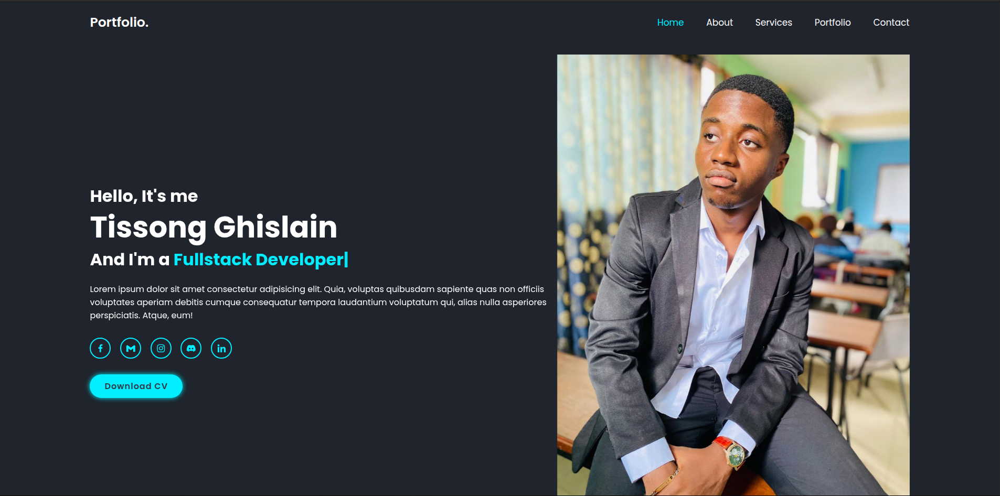

# my-portfolio



A sleek and fully responsive personal portfolio website built with **HTML**, **CSS**, and **JavaScript**. Designed to showcase your projects, skills, and contact information with a modern and clean layout.

---

## 🚀 Features

- **Responsive Design** – Fully optimized for mobile, tablet, and desktop devices  
- **Modern UI** – Clean layout with elegant styling  
- **Fast and Lightweight** – Minimal dependencies for fast performance  
- **Portfolio Section** – Highlight your recent work  
- **Contact Form** – Easily reachable via email  

---

## 🛠️ Technologies Used

- **HTML5** – Structure  
- **CSS3** – Styling and animations  
- **JavaScript** – Interactivity and behavior  

---

## 🔧 Setup & Usage

1. **Clone the repository**  
```bash
git clone https://github.com/Guy-Ghis/my-portfolio.git
```

2. **Open `index.html` in your browser
```bash
cd my-portfolio
open index.html
```

---

## 📫 Contact

Feel free to connect:

- 📧 Email: tissongguyghislain001@gmail.com

- 💼 LinkedIn: [guy ghislain tissong](https://www.linkedin.com/in/guy-ghislain-tissong-aa57b1341)

- 💬 Discord: [Guy-Ghis](https://discord.gg/EjzGhySM)

- 🐦 Twitter/X: [@That Ghis](https://x.com/ThatGhis?s=08)

- 🌐 Portfolio Website: [my-portfolio.com](https://guy-ghis.github.io/my-portfolio/)

---

## 📝 License

This project is licensed under the MIT License.

---

## ⭐️ Show Your Support

If you like this project, feel free to:

- 🌟 Star this repo

- 🍴 Fork it

- 🐛 Submit issues or pull requests